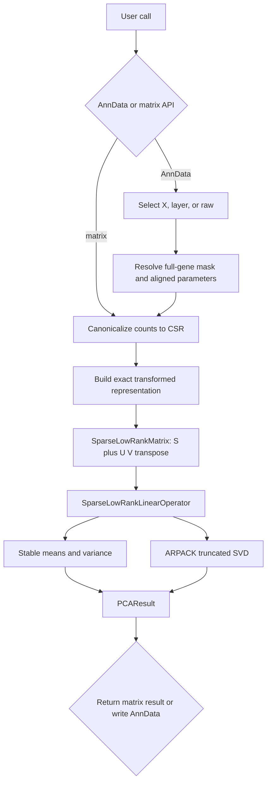
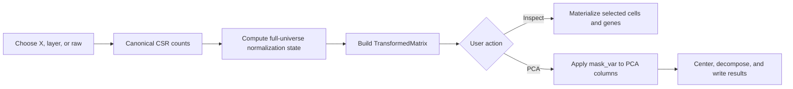
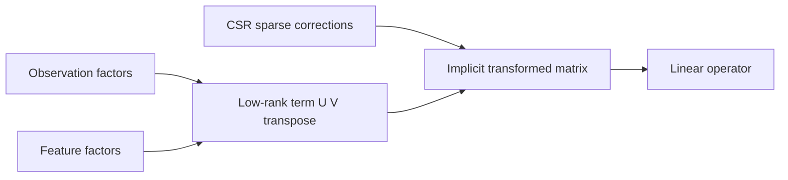
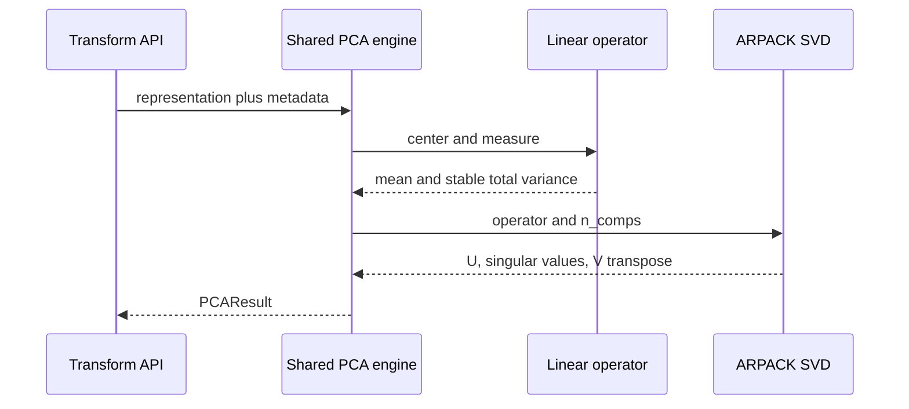

# Architecture

This is a guided code-reading path for contributors and reviewers of
`sparse-count-pca`. It emphasizes
the contracts that make the package exact and memory-efficient, then links to
the implementation and the tests that enforce each contract.

## Suggested reading order

1. [Public surface](#1-public-surface)
2. [Input and AnnData boundary](#2-input-and-anndata-boundary)
3. [Transform construction](#3-transform-construction)
4. [Sparse-plus-low-rank representation](#4-sparse-plus-low-rank-representation)
5. [Linear operator and numerical statistics](#5-linear-operator-and-numerical-statistics)
6. [Shared PCA execution](#6-shared-pca-execution)
7. [Correspondence analysis](#7-correspondence-analysis)
8. [Test and oracle strategy](#8-test-and-oracle-strategy)
9. [Review checklist](#9-review-checklist)

The normative mathematical contract is the
[package specification](specification.md).

The name describes the public contract rather than the implementation:
"count" covers single-cell, spatial, and general contingency-table inputs;
"PCA" is the primary analysis; and "sparse" states the scalability target.
Correspondence analysis remains as one closely related spectral method. The
linear-operator machinery stays private.

## System overview



The central boundary is the representation. Transform code decides what
matrix is being analyzed. The operator and SVD code know only how to multiply,
center, measure, and decompose `S + U @ V.T`.

## 1. Public surface

Start with [`src/sparse_count_pca/__init__.py`](https://github.com/jgarthur/sparse_count_pca/blob/main/src/sparse_count_pca/__init__.py).
It exports complete one-step analyses plus an explicit two-step transform API:

- residual PCA: `residual_pca`, `residual_pca_matrix`;
- count-scale CLR: `shifted_clr_pca` and its matrix variant;
- composition-scale CLR: `proportion_shifted_clr_pca` and matrix variant;
- prior-count transforms: `dirichlet_log_pca`, `dirichlet_clr_pca` and matrix
  variants;
- correspondence analysis;
- transform specifications and `transform`;
- `TransformedMatrix`, `PCAResult`, and `CorrespondenceAnalysisResult`.

`TransformedMatrix` is an uncentered SciPy `LinearOperator` backed by an exact
sparse-plus-low-rank representation. It supports block materialization and PCA.
The named one-step PCA functions build the same transform and immediately run
PCA. Correspondence analysis stays separate because masking changes its table
margins and its coordinate semantics differ from PCA.

Questions to ask during review:

- Is every public name sufficient to identify the mathematical transform?
- Are scientifically meaningful parameters explicit rather than inferred?
- Does each AnnData API have a matching matrix API?
- Is anything private being relied on as if it were public?

## 2. Input and AnnData boundary

Read these files together:

- [`_counts.py`](https://github.com/jgarthur/sparse_count_pca/blob/main/src/sparse_count_pca/_counts.py): count canonicalization and
  boolean-mask validation shared by every analysis;
- [`_anndata.py`](https://github.com/jgarthur/sparse_count_pca/blob/main/src/sparse_count_pca/_anndata.py): count-source selection,
  mask resolution, and generic PCA result writing;
- [`_transform.py`](https://github.com/jgarthur/sparse_count_pca/blob/main/src/sparse_count_pca/_transform.py): public transform
  specifications, implicit matrix products, materialization, and two-step PCA;
- [`_residual_pca.py`](https://github.com/jgarthur/sparse_count_pca/blob/main/src/sparse_count_pca/_residual_pca.py): residual-specific
  parameter alignment and both residual PCA entry points.

The important ordering is:



`mask_var` is a PCA feature selector, not a normalization-universe selector.
For example, CLR row means, Dirichlet prior normalization, cell totals, and
residual gene proportions are computed before the mask is applied. Excluded
genes receive `NaN` loadings when results are written back to AnnData.

The current transform backend owns an in-memory CSR sparse correction. Its
public contract is instead `LinearOperator` multiplication and block
materialization so a later backed implementation can stream observation blocks.
Variable-wide access warns because CSR must scan rows; `out=` avoids requiring a
second full dense allocation when users explicitly materialize the matrix.

Useful tests:

- [`tests/test_residual_anndata.py`](https://github.com/jgarthur/sparse_count_pca/blob/main/tests/test_residual_anndata.py)
- [`tests/test_residual_scanpy.py`](https://github.com/jgarthur/sparse_count_pca/blob/main/tests/test_residual_scanpy.py)
- mask-order tests in [`tests/test_log_pca.py`](https://github.com/jgarthur/sparse_count_pca/blob/main/tests/test_log_pca.py) and
  [`tests/test_dirichlet.py`](https://github.com/jgarthur/sparse_count_pca/blob/main/tests/test_dirichlet.py)

## 3. Transform construction

Transform builders return an exact `SparseLowRankMatrix`. They do not run PCA.

### Residual family

[`_residuals.py`](https://github.com/jgarthur/sparse_count_pca/blob/main/src/sparse_count_pca/_residuals.py) contains Poisson,
binomial, and size-factor-scaled negative-binomial Pearson and deviance
residual builders. For structural zeros, the residual baseline factorizes;
nonzero-count corrections are stored sparsely.

[`_clip.py`](https://github.com/jgarthur/sparse_count_pca/blob/main/src/sparse_count_pca/_clip.py) applies exact clipping. Symmetric
clipping may add sparse entries where structural-zero residuals cross the
lower threshold, so it has an explicit support-growth guard.

### Log and CLR family

[`_log_transforms.py`](https://github.com/jgarthur/sparse_count_pca/blob/main/src/sparse_count_pca/_log_transforms.py) contains the
shared algebra. Its primitive sparse correction is

```text
S_ij = log1p(X_ij / prior_count_j),
```

which is zero on structural zeros and therefore preserves sparse support.

[`_log_pca.py`](https://github.com/jgarthur/sparse_count_pca/blob/main/src/sparse_count_pca/_log_pca.py) provides the count-scale and
composition-scale PCA APIs.
[`_dirichlet_pca.py`](https://github.com/jgarthur/sparse_count_pca/blob/main/src/sparse_count_pca/_dirichlet_pca.py) provides the
prior-count parameterization and AnnData prior alignment.

| Transform | Shift domain | Representation rank | Empty cells |
| --- | --- | ---: | --- |
| shifted CLR | fixed raw count | 1 | rejected by input policy |
| composition-scale shifted CLR | composition scale | 1 | rejected |
| Dirichlet log closure | prior counts | at most 2 | rejected by input policy |
| Dirichlet CLR | prior counts | at most 2 | rejected by input policy |

The defining cross-check is:

```text
shifted_clr(count_shift=a)
    == dirichlet_clr(concentration=n_vars * a, uniform prior).
```

### Residual and log transforms are separate families

Residuals are deviations from a fitted null mean. Log transforms construct
positive abundance coordinates. They share an execution engine, not a model
enum. This separation is intentional.

## 4. Sparse-plus-low-rank representation

Read [`_representation.py`](https://github.com/jgarthur/sparse_count_pca/blob/main/src/sparse_count_pca/_representation.py).

The sole representation is

```text
M = S + U @ V.T
```

with CSR `S`, dense factors `U` and `V`, and rank including zero. Column
selection and row/column scaling preserve this form.



Review the shape checks closely. Representation bugs tend to be inexpensive
to detect here and expensive to diagnose after ARPACK.

Useful tests:

- [`tests/test_operator.py`](https://github.com/jgarthur/sparse_count_pca/blob/main/tests/test_operator.py), especially ranks 0, 1,
  and 3;
- transform materialization tests in
  [`tests/test_log_pca.py`](https://github.com/jgarthur/sparse_count_pca/blob/main/tests/test_log_pca.py),
  [`tests/test_dirichlet.py`](https://github.com/jgarthur/sparse_count_pca/blob/main/tests/test_dirichlet.py), and
  [`tests/test_deviance.py`](https://github.com/jgarthur/sparse_count_pca/blob/main/tests/test_deviance.py).

## 5. Linear operator and numerical statistics

[`_operator.py`](https://github.com/jgarthur/sparse_count_pca/blob/main/src/sparse_count_pca/_operator.py) turns the representation
into a SciPy `LinearOperator`:

```text
A = S + U @ V.T - 1 @ mean.T
```

when PCA column centering is enabled.

The multiplication paths are straightforward; the numerically delicate part
is stable means and Frobenius norms. Sparse corrections and low-rank baselines
can be individually large and nearly cancel. The implementation therefore
computes actual represented values on stored support and treats sparse and
nearly dense columns differently instead of subtracting large component norms.

Pay particular attention to:

- operator dtype versus float64 summary-statistic dtype;
- the stored operator mean used by both multiplication and variance;
- the numerical-zero variance criterion before ARPACK;
- transpose multiplication and multi-vector paths.

The adversarial variance cases live in
[`tests/test_residual_pca.py`](https://github.com/jgarthur/sparse_count_pca/blob/main/tests/test_residual_pca.py).

## 6. Shared PCA execution

[`_pca.py`](https://github.com/jgarthur/sparse_count_pca/blob/main/src/sparse_count_pca/_pca.py) is the transform-independent PCA
engine. It validates dimensions and dtype, creates the centered operator,
checks variance, calls the SVD layer, calculates variance summaries, and
returns `PCAResult`.

When `return_operator=True` hands the centered operator back to the caller,
ownership decides whether its arrays are copied. An operator derived from a
live `TransformedMatrix` would otherwise share that object's arrays, so it
takes a support-sized copy. A one-step call such as `residual_pca_matrix`
builds a representation nothing else holds, so it passes those arrays directly
and skips the copy.

[`_svd.py`](https://github.com/jgarthur/sparse_count_pca/blob/main/src/sparse_count_pca/_svd.py) owns the narrow ARPACK contract:

- deterministic starting vector from `random_state`;
- descending singular-value order;
- scikit-learn-compatible sign flipping;
- float64 singular values even for a float32 operator.



This is the best place to review whether all PCA families report consistent
statistics and reproducibility metadata.

## 7. Correspondence analysis

[`_correspondence.py`](https://github.com/jgarthur/sparse_count_pca/blob/main/src/sparse_count_pca/_correspondence.py) uses the same
representation and operator machinery but is not ordinary column-centered
PCA. Classical CA reuses the stable Poisson Pearson representation with a
`1 / sqrt(grand_total)` scale. The explicitly experimental `model="scaled_nb"`
path substitutes scaled-NB Pearson residuals at the same total scaling. Both
report row and column principal coordinates and inertia; standard coordinates
are not stored because they are derivable as principal coordinates divided by
singular values.

Only the Poisson path has the classical chi-square and full barycentric
interpretations. The scaled-NB path retains observed count masses for
coordinate scaling and reports residual inertia.

Keep it out of generic PCA helpers unless an abstraction preserves its
different centering, scaling, result type, and coordinate semantics.

Reference coverage is in
[`tests/corral_reference/`](https://github.com/jgarthur/sparse_count_pca/tree/main/tests/corral_reference) and
[`tests/test_correspondence.py`](https://github.com/jgarthur/sparse_count_pca/blob/main/tests/test_correspondence.py).

## 8. Test and oracle strategy

The suite has four complementary layers:

1. shared independent dense formulas for small simulated matrices and the full
   real-data fixture;
2. operator product and stable-statistic checks;
3. dense SVD comparisons for singular values and subspaces;
4. pinned external provenance for literature/software compatibility.

Reference directories:

- [`tests/townes_reference/`](https://github.com/jgarthur/sparse_count_pca/tree/main/tests/townes_reference): residual PCA;
- [`tests/corral_reference/`](https://github.com/jgarthur/sparse_count_pca/tree/main/tests/corral_reference): correspondence
  analysis;
- [`tests/shifted_clr_reference/`](https://github.com/jgarthur/sparse_count_pca/tree/main/tests/shifted_clr_reference): current
  count-scale PFlog;
- [`tests/proportion_shifted_clr_reference/`](https://github.com/jgarthur/sparse_count_pca/tree/main/tests/proportion_shifted_clr_reference):
  historical composition-scale shifted CLR;
- [`tests/real_data_reference/`](https://github.com/jgarthur/sparse_count_pca/tree/main/tests/real_data_reference):
  deterministic observed-depth and equal-depth PBMC3k-derived fixtures,
  full-matrix coverage for every transform family, and a pinned SCTransform v2
  equality oracle.

Normal tests are offline. Regeneration tooling is provenance, not a runtime
dependency.

## 9. Review checklist

### Mathematical contracts

- Do structural-zero values have the claimed factorization?
- Does each sparse correction equal actual transformed value minus baseline?
- Are count, composition, and prior-count shift domains never conflated?
- Are CLR means computed over the intended full gene universe?
- Do correspondence-analysis margins use the selected contingency table?

### Numerical contracts

- Can large terms cancel in a new statistic?
- Does float32 describe the matrix actually passed to ARPACK?
- Are boundary cases evaluated with stable `log1p` or series forms?
- Does a zero-variance matrix fail before iterative decomposition?

### API contracts

- Are matrix and AnnData results semantically aligned?
- Are arrays aligned before masking?
- Does metadata contain enough state to reproduce the analysis?
- Are empty-cell and zero-gene behaviors explicit?
- Does a new transform deserve a named public function?

### Scalability contracts

- Is work `O(nnz + n_obs * rank + n_vars * rank)` where expected?
- Are support-sized temporaries duplicated?
- Can clipping or conversion unexpectedly densify?
- Can a downstream operation stream rows or columns instead of materializing?
